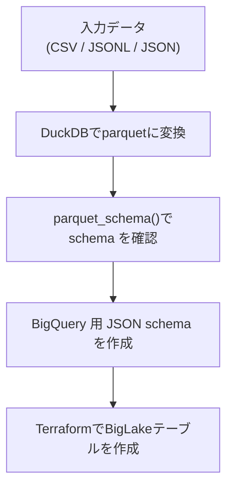

## 内容

BigQueryのBigLakeテーブルをTerraform [google_bigquery_schema](https://registry.terraform.io/providers/hashicorp/google/latest/docs/resources/bigquery_table)で作成する場合、
`external_data_configuration`引数に情報を入れ、`schema`引数にスキーマの情報をjsonで書く必要があります。
その際、ListやMap型のような複数の要素を持つデータについて、どのようにjsonで型を定義すればいいのかで多少時間を消費してしまうことがありました。

本記事では「スムーズな定義方法」と、「なぜそれでうまくいくのか」を書いていきます。

## スムーズな定義方法

スムーズに定義を行うおすすめの方法は[duckDB](https://duckdb.org/)の[Auto Detection](https://duckdb.org/docs/stable/data/csv/auto_detection)でファイルを読み取り→[parquetファイルで書き出し](https://duckdb.org/docs/stable/sql/statements/copy#copy--to)、[parquet_schema()](https://duckdb.org/docs/stable/data/parquet/metadata#parquet-schema)を用いてparquet metadataを表示し、それをもとにjsonスキーマを作成する です。




## BigLakeでのparquet読み取り時List Logical Type仕様

「なぜこれでうまくいくのか」はBigQuery,parquet,DuckDBの仕様を読むとわかります。

https://docs.cloud.google.com/bigquery/docs/loading-data-cloud-storage-parquet#list_logical_type

> BigQuery checks whether the LIST node is in the standard form or in one of the forms described by the backward-compatibility rules:

```
// standard form
<optional | required> group <name> (LIST) {
  repeated group list {
    <optional | required> <element-type> element;
  }
}
```

BigQueryのLoad DataでList論理型を読む場合はparquet-formatの[standard form](https://github.com/apache/parquet-format/blob/master/LogicalTypes.md#lists)に則ればよさそうです。

```example
// List<String> (list non-null, elements nullable)
required group my_list (LIST) {
  repeated group list {
    optional binary element (STRING);
  }
}

// List<String> (list nullable, elements non-null)
optional group my_list (LIST) {
  repeated group list {
    required binary element (STRING);
  }
}
```

本記事では省略しますが、[backward-compatibility rules](https://github.com/apache/parquet-format/blob/master/LogicalTypes.md#backward-compatibility-rules)に従う形でも良いです。


### BigQuery ネストや繰り返しの列定義

また、JSONで定義する際のtype(型)については以下のようにまとまっています。

https://docs.cloud.google.com/bigquery/docs/nested-repeated?utm_source=chatgpt.com

> To create a column with nested data, set the data type of the column to RECORD in the schema. A RECORD can be accessed as a STRUCT type in GoogleSQL. A STRUCT is a container of ordered fields.

> To create a column with repeated data, set the mode of the column to REPEATED in the schema. A repeated field can be accessed as an ARRAY type in GoogleSQL.

> A RECORD column can have REPEATED mode, which is represented as an array of STRUCT types. Also, a field within a record can be repeated, which is represented as a STRUCT that contains an ARRAY. An array cannot contain another array directly. For more information, see Declaring an ARRAY type.

- BigQueryの`RECORD`型はGoogleSQLの`STRUCT`型に対応する
- `REPEATED`型はGoogleSQLの`ARRAY`型に対応する
- `RECORD`型のカラムは`REPEATED`を持つことができ、`ARRAY<STRUCT<...>>`として扱われる
- `ARRAY`の中に`ARRAY`を入れることはできない


## duckDBでのparquet_schema仕様

https://duckdb.org/docs/stable/data/parquet/metadata#parquet-schema

> Note that this is the schema as it is contained within the metadata of the Parquet file. If you want to figure out the column names and types contained within a Parquet file it is easier to use DESCRIBE.


`parquet_schema()`ではparquetファイルのメタデータを表示している旨が記載されています。

DESCRIBEではduckDBの解釈ベースの表示になるため`parquet_schema()`を使うのが適切そうです。


## 実際に試してみる

ということで、スムーズな定義方法について試してみます。

環境は

- duckdb v1.4.2
- terraform v1.12.2
- terraform hashicorp/google v.5.45.2


使用するデータは以下のような形です。

```json:test.jsonl
{"id":1,"nums":[1,2,null],"events":[{"ts":"2025-12-01T00:00:00Z","kind":"a"},{"ts":null,"kind":"b"}],"tags":[{"key":"env","value":"prod"},{"key":"team","value":null}]}
{"id":2,"nums":[],"events":null,"tags":[{"key":"env","value":"dev"}]}
{"id":3,"nums":null,"events":[],"tags":null}
```


まずはjsonl to parquetの.sqlファイルを作り変換します。

```sql:test.jsonl.transform.sql
COPY (
    SELECT * FROM read_json_auto('test.jsonl')
) TO 'test.parquet' (FORMAT PARQUET);
```


```duckdb
D .read test.jsonl.transform.sql
```


生成されたparquetファイルからparquet schema情報を見てみます。


```duckdb
D select * from parquet_schema('test.parquet');
┌──────────────┬───────────────┬───┬──────────────────────┬─────────────┐
│  file_name   │     name      │ … │     logical_type     │ duckdb_type │
│   varchar    │    varchar    │   │       varchar        │   varchar   │
├──────────────┼───────────────┼───┼──────────────────────┼─────────────┤
│ test.parquet │ duckdb_schema │ … │ NULL                 │ NULL        │
│ test.parquet │ id            │ … │ NULL                 │ BIGINT      │
│ test.parquet │ nums          │ … │ NULL                 │ NULL        │
│ test.parquet │ list          │ … │ NULL                 │ NULL        │
│ test.parquet │ element       │ … │ NULL                 │ BIGINT      │
│ test.parquet │ events        │ … │ NULL                 │ NULL        │
│ test.parquet │ list          │ … │ NULL                 │ NULL        │
│ test.parquet │ element       │ … │ NULL                 │ NULL        │
│ test.parquet │ ts            │ … │ TimestampType(isAd…  │ TIMESTAMP   │
│ test.parquet │ kind          │ … │ NULL                 │ VARCHAR     │
│ test.parquet │ tags          │ … │ NULL                 │ NULL        │
│ test.parquet │ list          │ … │ NULL                 │ NULL        │
│ test.parquet │ element       │ … │ NULL                 │ NULL        │
│ test.parquet │ key           │ … │ NULL                 │ VARCHAR     │
│ test.parquet │ value         │ … │ NULL                 │ VARCHAR     │
├──────────────┴───────────────┴───┴──────────────────────┴─────────────┤
│ 15 rows                                          12 columns (4 shown) │
└───────────────────────────────────────────────────────────────────────┘
```


`DESCIBE`の場合このような表示になります。


```duckdb
D DESCRIBE SELECT * FROM 'test.parquet';
┌─────────────┬─────────────────────────┬─────────┬─────────┬─────────┬─────────┐
│ column_name │       column_type       │  null   │   key   │ default │  extra  │
│   varchar   │         varchar         │ varchar │ varchar │ varchar │ varchar │
├─────────────┼─────────────────────────┼─────────┼─────────┼─────────┼─────────┤
│ id          │ BIGINT                  │ YES     │ NULL    │ NULL    │ NULL    │
│ nums        │ BIGINT[]                │ YES     │ NULL    │ NULL    │ NULL    │
│ events      │ STRUCT(ts TIMESTAMP, …  │ YES     │ NULL    │ NULL    │ NULL    │
│ tags        │ STRUCT("key" VARCHAR,…  │ YES     │ NULL    │ NULL    │ NULL    │
└─────────────┴─────────────────────────┴─────────┴─────────┴─────────┴─────────┘
```


terraformからBigLakeテーブルを作るためのjsonを作成し、BigLakeテーブルを作ります。

duckDBのparquet_schemaのnameを見つつ書いていきます。

```json:schema.json( #以降はコメント)
[
    {
        "name": "id",
        "type": "INT64", # idはINTの1要素
        "mode": "NULLABLE"
    },
    {
        "name": "nums",
        "type": "RECORD",
        "mode": "NULLABLE", # numsはnullも存在する数字配列
        "fields": [
            {
                "name": "list",
                "type": "RECORD",
                "mode": "REPEATED", # RECORD型はREPEATED型を持てる。DuckDBでみるとここがlistなのでname = listとする
                "fields": [
                    {
                        "name" : "element", # DuckDBで見るとelementなのでそのように定義
                        "type": "INT64",
                        "mode": "NULLABLE"
                    }
                ]
            }
        ]
    },
    {
        "name": "events", # numsと流れは大体一緒。
        "type": "RECORD",
        "mode": "NULLABLE",
        "fields": [
            {
                "name": "list",
                "type": "RECORD",
                "mode": "REPEATED",
                "fields" : [
                    {
                        "name": "element",
                        "type": "RECORD",
                        "mode": "NULLABLE",
                        "fields": [ # ここがtsとkindで分かれて型定義
                            {
                                "name": "ts",
                                "type": "TIMESTAMP",
                                "mode": "NULLABLE"
                            },
                            {
                                "name": "kind",
                                "type": "STRING",
                                "mode": "NULLABLE"
                            }
                        ]
                    }
                ]
            }
        ]
    },
    {
        "name": "tags", # eventsと大体一緒
        "type": "RECORD",
        "mode": "NULLABLE",
        "fields": [
            {
                "name": "list",
                "type": "RECORD",
                "mode": "REPEATED",
                "fields" : [
                    {
                        "name": "element",
                        "type": "RECORD",
                        "mode": "NULLABLE",
                        "fields": [
                            {
                                "name": "key",
                                "type": "STRING",
                                "mode": "NULLABLE"
                            },
                            {
                                "name": "value",
                                "type": "STRING",
                                "mode": "NULLABLE"
                            }
                        ]
                    }
                ]
            }
        ]
    }
]

```

作成したjsonファイルをBigLakeテーブルのスキーマ定義に使い、terraformでBigLakeテーブルを作ります。

```tf:main.tf
variable "project_id" {
  description = "GCP Project ID"
  type        = string
  default     = "xxxxxxxx"
}
variable "region" {
  description = "GCP Region"
  type        = string
  default     = "asia-northeast1"
}
variable "dataset_id" {
  description = "BigQuery Dataset ID"
  type        = string
  default     = "biglake_test_dataset"
}
variable "table_id" {
  description = "BigQuery Table ID"
  type        = string
  default     = "external_table_test"
}
variable "gcs_bucket" {
  description = "GCS Bucket for BigLake data"
  type        = string
  default     = "yyyyyyyy"
}
variable "gcs_path" {
  description = "GCS Path for BigLake data"
  type        = string
  default     = "biglake/test_data/*"
}
# BigQuery Dataset
resource "google_bigquery_dataset" "biglake_dataset" {
  dataset_id  = var.dataset_id
  location    = var.region
  description = "Dataset for BigLake external table testing"
}
# BigLake用のCloud Resource Connection
resource "google_bigquery_connection" "biglake" {
  connection_id = "biglake-test-connection"
  location      = var.region
  friendly_name = "BigLake Test Connection"
  description   = "Connection for BigLake external tables to access Cloud Storage"
  cloud_resource {}
}
# BigLake External Table
resource "google_bigquery_table" "external" {
  dataset_id  = google_bigquery_dataset.biglake_dataset.dataset_id
  table_id    = var.table_id
  description = "BigLake external table for testing"
  # スキーマファイルを読み込み
  schema              = file("${path.module}/schema.json")
  deletion_protection = false
  external_data_configuration {
    autodetect    = false
    source_format = "PARQUET"
    source_uris = [
      "gs://${var.gcs_bucket}/${var.gcs_path}"
    ]
    connection_id       = google_bigquery_connection.biglake.id
    metadata_cache_mode = "AUTOMATIC"
  }
  max_staleness = "0-0 0 10:0:0" # 10時間
  depends_on = [
    google_bigquery_dataset.biglake_dataset,
    google_bigquery_connection.biglake
  ]
}
# BigLake Connection用のサービスアカウントにCloud Storageへのアクセス権限を付与
resource "google_storage_bucket_iam_member" "biglake_storage" {
  bucket = var.gcs_bucket
  role   = "roles/storage.objectViewer"
  member = "serviceAccount:${google_bigquery_connection.biglake.cloud_resource[0].service_account_id}"
}

```

```tf:provider.tf
terraform {
  required_version = ">= 1.0.0"

  required_providers {
    google = {
      source  = "hashicorp/google"
      version = "~> 5.0"
    }
  }
}

provider "google" {
  project = var.project_id
  region  = var.region
}
```

```bash
$ terraform init
$ terraform plan
$ terraform apply
...
Apply complete! Resources: 4 added, 0 changed, 0 destroyed.
```


指定のGCSにtest.parquetを配置し、適切に読めているかをテストします。


無事に読めていますね！テストデータでは空配列`[]`と`null`がどちらもありますので、その場合は最外層定義時にmodeを`NULLABLE`にすればこのように読めます。

## まとめ

BigLakeテーブルでparquetファイルを読ませる際の型定義は[parquet-schema List Logical Type](https://github.com/apache/parquet-format/blob/master/LogicalTypes.md#lists)に従って解釈されるので、それに準じたjson schemaを定義すればよい


ここまで読んでいただきありがとうございました。誤りや意見などあればコメントいただけますと嬉しいです。
